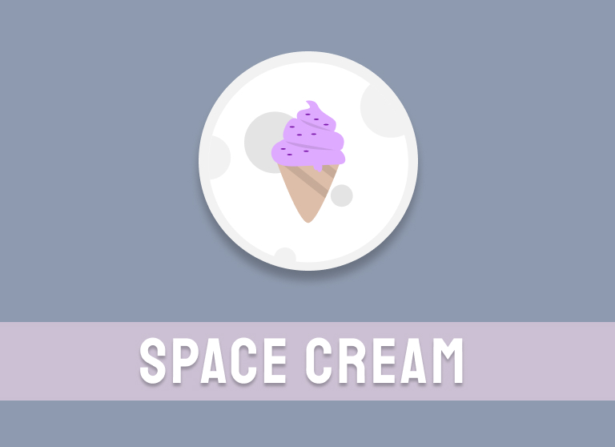

<h1 align="center"> Space Cream </h1>

Site de sorvetes  

  <a href="#-tecnologias">Tecnologias</a>&nbsp;&nbsp;&nbsp;|&nbsp;&nbsp;&nbsp;
  <a href="#-projeto">Projeto</a>&nbsp;&nbsp;&nbsp;|&nbsp;&nbsp;&nbsp;
  <a href="#-layout">Layout</a>&nbsp;&nbsp;&nbsp;|&nbsp;&nbsp;&nbsp;
  <a href="#memo-licença">Licença</a>

  

 

  

## 🚀 Tecnologias

Esse projeto foi desenvolvido com as seguintes tecnologias:

- HTML e CSS
- JavaScript
- Git e Github
- Figma

## 💻 Projeto

Trabalhando conceito mobile first e animações css comoa exemplo das @keyframes e :hover

## Layout

Você pode visualizar o projeto através [DESSE LINK](https://www.figma.com/file/Sh4dkxm2A3ItqYZQy7dQWz/Stage-03---Mobile-First-(Copy)?type=design&node-id=0-1&t=hO6ygTELs7ClytYP-0)

- [Visite o projeto online](elidepaixao.github.io/spacecream1/)