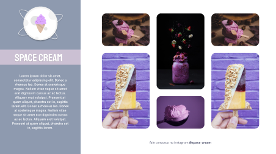

<h1 align="center"> Space Cream Desktop and Mobile</h1>

Site de sorvetes  

  <a href="#-tecnologias">Tecnologias</a>&nbsp;&nbsp;&nbsp;|&nbsp;&nbsp;&nbsp;
  <a href="#-projeto">Projeto</a>&nbsp;&nbsp;&nbsp;|&nbsp;&nbsp;&nbsp;
  <a href="#-layout">Layout</a>&nbsp;&nbsp;&nbsp;|&nbsp;&nbsp;&nbsp;
  <a href="#memo-licença">Licença</a>

  

 

  

## 🚀 Tecnologias

Esse projeto foi desenvolvido com as seguintes tecnologias:

- HTML e CSS
- Git e Github
- Figma

## 💻 Projeto

Trabalhando o conceito mobile first e animações CSS

## Layout

Você pode visualizar o projeto através [DESSE LINK](https://www.https://www.figma.com/file/YkJZvFRcfh61UWOq1vo96Q/Stage-03---Grid-com-anima%C3%A7%C3%B5es-(Copy)?node-id=6%3A2&mode=dev)

- [Visite o projeto online](elidepaixao.github.io/spacecream/)